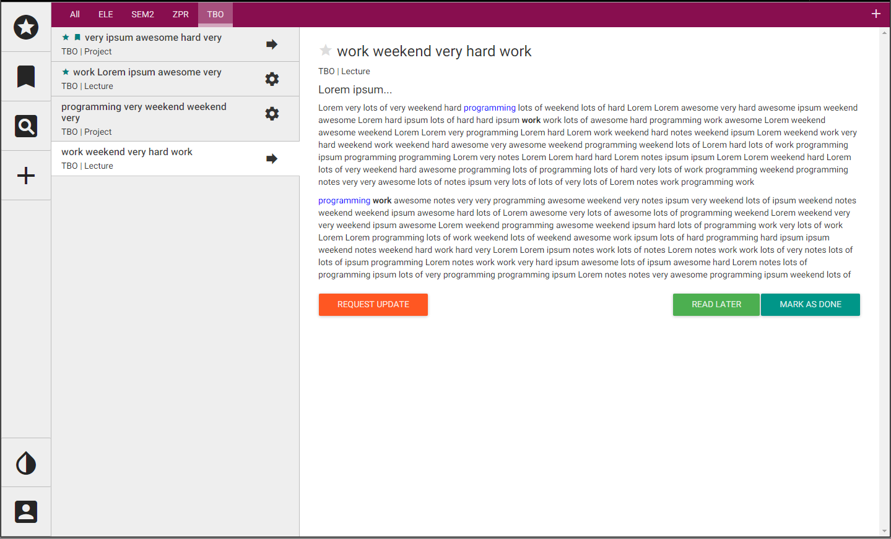
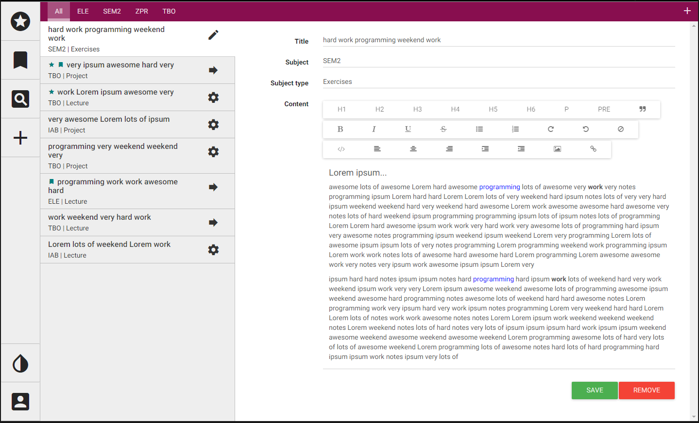
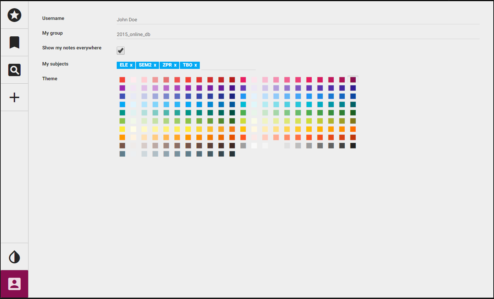

# Notes CMS

## Functionality

- Adding/Managing notes
- Adding subjects (tabs)
- Bookmarking
- Adding to favourites
- Basic user profile page

### TODO

- Admin pages
- "My Notes" section as a part of user profile page
- Server side, storing users, notes, logging
- Binding taginput to subjects
- Advanced search by:
	- Author
	- Subject
	- Group
	- Keyword
	- Type of class
	- Tags
- Quick search with autocomplete (from navbar)

### Screenshots

